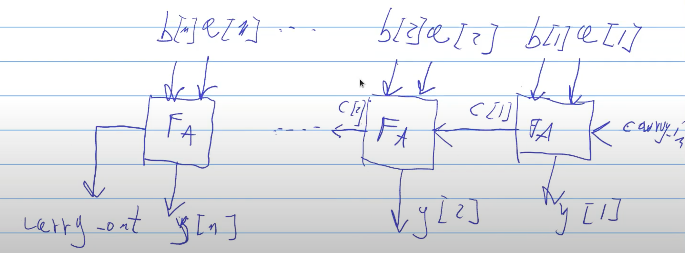

# 0040-nbit-fulladder

Metto in fila n full adder

Il file che contiene la funzione full_adder è esattamente lo stesso del modello a 2 bit (0020).
Una prima differenza è invece il suv.

Ciò che voglio ottenere è il modello di n full adder messi in fila, così da processare un numero di bit pari a quello che voglio e generare una stringa $y_1,y_2,y_3,\ldots,y_n$.

Lo schema è il seguente:

