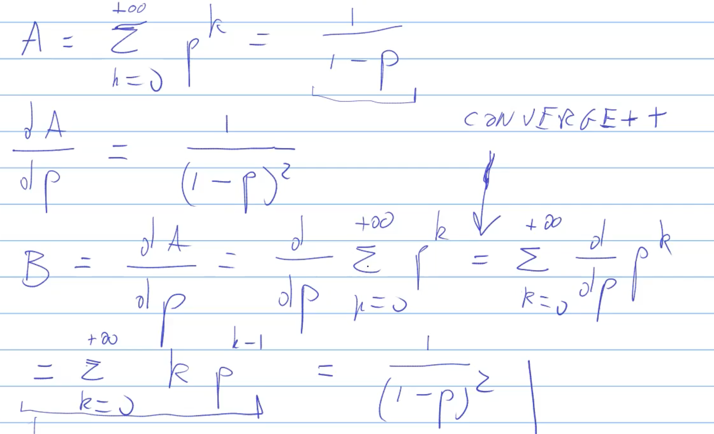

# 1200-plan-driven-sw-dev

Posso utilizzare Modelica per simulare le fasi dello sviluppo software plan driver.

Questo tipo di sviluppo è composto da 8 fasi:
1. requirement phase
2. design phase
3. implementation phase
4. unit testing phase
5. integration phase
6. integration testing phase
7. acceptance testing phase
8. delivery

Il monitor di questo modello è diverso dal solito. Non è un monitor che utilizzo per verificare una proprietà del tipo vero/falso, ma è un monitor che calcola il **valore atteso**, che fa parte dei requisiti non funzionali. Devo calcolare il tempo atteso in cui arrivo allo stato numero 8 della catena di Markov.

# Differenza tra when initial() e initial equation
Se io uso le equazioni faccio la **initial equation** che vale al tempo 0. Poi nella equation avrò una equazione che sarà valida per tutti i successivi istanti di tempo. Serve se una variabile ad esempio è definita come un'equazione differenziale, quindi con der(). Vedi 0120, in particolare **car.mo**

La **when initial()** si utilizza in un ambiente **algorithm** e **elsewhen** specifica il comportamento nei successivi istanti di tempo.

# Valore atteso del tempo di soggiorno
Supponiamo di essere in uno stato della catena di Markov, ho una probabilità $p$ di rimanere sullo stato corrente e una probabilità $1-p$ di passare ad un altro stato, pari alla somma di tutti gli archi uscenti che non mi portano allo stato corrente.

Per calcolare il valore atteso del tempo di soggiorno, devo calcolare il numero di volte in cui sono nel loop.

La probabilità che io vada via da quello stato dopo una transizione è dato da:

$$
E[s] = 1 \cdot (1 - p)
$$

La probabilità che vada via dopo due transizioni è dato da:

$$
E[s] = 1 \cdot (1 - p) + 2p(1-p)
$$

La probabilità che vada via dopo tre transizioni è dato da:

$$
E[s] = 1 \cdot (1 - p) + 2p(1-p) + 3p^2(1-p)
$$

Per completezza, la probabilità che vada via dopo quattro transizioni è dato da:

$$
E[s] = 1 \cdot (1 - p) + 2p(1-p) + 3p^2(1-p) + 4p^3(1-p)
$$

E così via per le transizioni successive.

Scriviamolo in modo generico:

$$
E[s] = (1-p) \sum\limits_{k=0}^{+\infty} kp^{k-1}
$$

Con $p<1$, perché se $p$ fosse 1, non uscirei mai dallo stato corrente.

Tra le serie note c'è la seguente: 

$$
\sum\limits_{k=0}^{+\infty}p^k = A = \frac{1}{1-p}
$$

Che è simile, ma non identica. Riconducendoci a quella serie otteniamo che la serie che non conosciamo è uguale a:

$$
\frac{1}{(1-p)^2}
$$

Quindi:

$$
E[s] = (1-p) \frac{1}{(1-p)^2} = \frac{1}{1-p}
$$

E quindi:

$$
E[s_T] = \frac{T}{1-p}
$$

Quindi, se sulla catena di Markov metto $\frac{9}{10}$ come probabilità di passare ad uno stato, vuol dire che:

$$
\frac{1}{1-\frac{9}{10}} = \frac{1}{1-0.9} = \frac{1}{0.1} = 10
$$

E quindi $10T$ è il valore atteso del tempo di soggiorno.

A questo punto considero il sampling time (che nel nostro caso è un giorno), quindi il nostro valore atteso del tempo di soggiorno in quello stato è di 10 giorni. In questo modo ho legato il parametro della catena di Markov alla catena di Markov.

Questo calcolo è estremamente importante, perché ci permette di impostare il tempo medio di soggiorno nella catena di Markov.

La dimostrazione di come arrivo a $\frac{1}{(1-p)^2}$ è la seguente:

