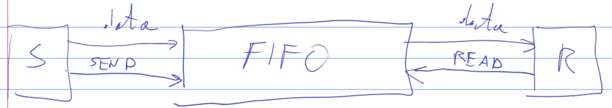

# 1300-communication-channel

Finora abbiamo visto simulazioni in cui la comunicazione è **sincrona**. Nella realtà non è sempre così, ad esempio se invio un messaggio tramite una socket in internet, non avrò una comunicazione sincrona, ma asincrona.

Dobbiamo quindi modellare un buffer e una FIFO. Invece di fare prima il modello e poi il monitor, farò prima il monitor e poi il modello.

Il sender invia un messaggio, questo messaggio finisce nella FIFO e quindi il receiver lo legge in un momento successivo.

Il **sender** oltre ai dati da inviare invierà un segnale **send**, e il **receiver** prima di leggere invierà un segnale **read**. Secondo questo schema:

In questo modello vogliamo fare astrazione rispetto al tempo.

Cosa succede se invio un messaggio e la FIFO è piena?
Posso scegliere vari approcci:

* Ignoro il messaggio
* Il **sender** fa prima un check per vedere se la coda è piena (e il **reader** controlla che non sia vuota)

Il canale di comunicazione è definito in **channel.mo**.

Non c'è nessuna **when sample()** perché il modello è completamente **asincrono**.