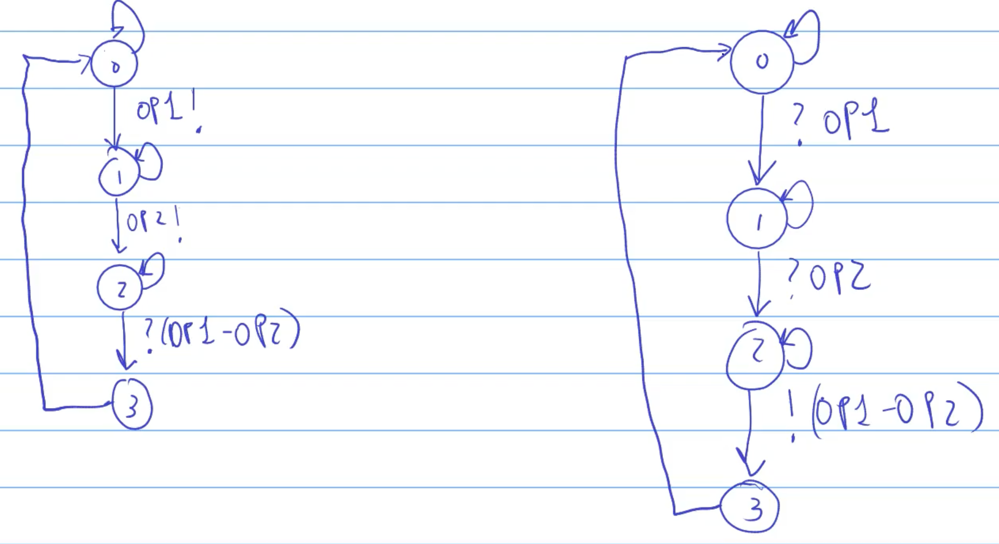

# 2250-client-server

In questo esempio modelliamo un classico paradigma client-server. In questo caso il client manda al server due operandi. Il server restituirà al client la loro differenza.

Così come il canale di comunicazione, anche questa simulazione è di tipo event-driven.

Il funzionamento sarà il seguente:
1. Il client manda al server il primo operando (op1).
2. Il client manda al server il secondo operando (op2).
3. Il server risponde al client con la differenza op1 - op2.

Devo modellare un segnale che quando si inverte indica l'evento, come su **1350**.

Quando modelliamo un blocco e quando guardiamo gli input, dobbiamo sempre considerare il **pre**, per evitare contraddizioni.

Immaginiamo il sistema come un automa:

Il client ha uno stato iniziale e può starci quanto tempo vuole, poi manda l'operando 1 e passa ad un altro stato, dove rimane quanto vuole e poi manda l'operando 2. A questo punto va in uno stato di attesa, dove aspetta che il server risponda. Quando arriva la risposta del server, vado in un ulteriore stato dove magari stampo l'input, poi torno allo stato iniziale.

Il server ha uno stato iniziale dove è in attesa di ricevere il primo operando. Quando lo riceve passa in un altro stato dove aspetta di ricevere il secondo operando. Quando arriva il secondo operando, va in uno stato dove esegue la computazione op1 - op2. A questo punto invia la risposta al client e va in un altro stato, per poi tornare allo stato iniziale.

Lo schema di client e server è il seguente:

Utilizzo inoltre due code, definita in **queue.mo** per la gestione degli input del server e del client.

I modelli di client e server utilizzano un program counter per gestire l'esecuzione delle istruzioni, che simulano gli stati dei rispettivi automi.