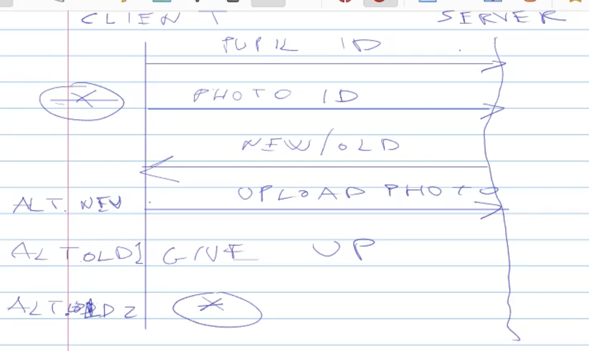
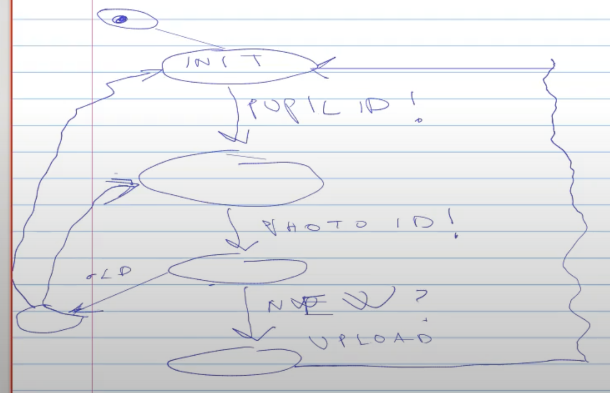

# 2500-photo-sharing

In questo modello abbiano una classe, gli studenti di questa classe potevano fare l'upload delle foto sul sito. Dopodiché dare un nome alla foto. Se quel nome era già presente il nome veniva mandato indietro, chi inviava a questo punto poteva cambiare nome o rinunciare.

La struttura di questo modello è molto simile a quella di 2250.

Il modello è composto da un pool di studenti e da un server.

Innanzitutto il client sceglie l'id dello studente, dopodiché sceglie l'id della foto, chiede l'uploading e aspetta la risposta del server. Il server può inviare due risposte:
1. Il nome è già esistente, quindi il client deve cambiare nome o rinunciare.
2. Il nome è disponibile.

La comunicazione è strutturata così:
1. Il client invia al server l'id dello studente.
2. Il client invia al server l'id della foto.
3. Il server deve andare a vedere se quello studente ha già mandato l'id di quella foto oppure no e invia una risposta **new/old**.
4. Se ho ricevuto **new**, il client esegue l'upload della foto.
5. Se ho ricevuto **old**, il client può o rinunciare inviando un **giveup** (se rinuncia si ricomincia da capo), oppure ritornare alla fase 2, inviando il nuovo id della foto.

Lo schema è il seguente:

Possiamo immaginare il client come un automa a stati finiti, che ha il seguente schema:

Devo ora dotarmi di due code da utilizzare come canali di comunicazione per scambiare messaggi dal client al server e viceversa.

> La lettura di una variabile avviene sempre sul pre(). Le print sono fondamentali per il debug.